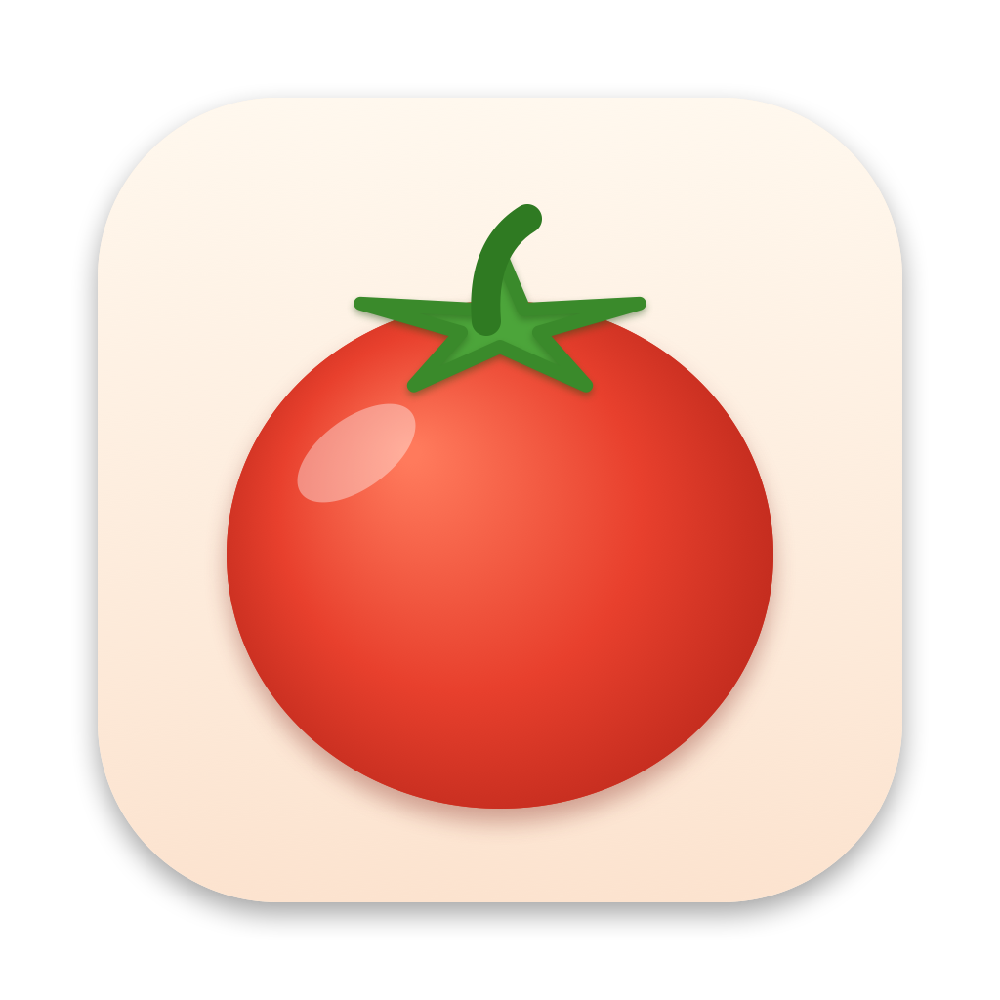

# Pomodoro for macOS



A native SwiftUI Pomodoro timer with a main window and a menu bar timer.

## Features

- Focus / Short Break / Long Break phases with a progress ring
- Automatic long break after N focus sessions
- Live countdown in the menu bar, with a mini control panel
- System notifications and sounds when a session ends
- Configurable durations, auto-start, and sound (Settings, ⌘,)
- Keyboard shortcuts for start/pause, reset, and skip

## Installation

Requires macOS 14+ and Apple's Command Line Tools (`xcode-select --install`). Xcode is not required.

```bash
git clone https://github.com/lawwu/pomodoro-mac.git
cd pomodoro-mac
./build-app.sh
cp -R build/Pomodoro.app /Applications/
```

Open **Pomodoro** from Applications, Launchpad, or Spotlight. On first launch, click **Allow** when asked about notifications so you're alerted when a session ends.

To update later:

```bash
git pull && ./build-app.sh && cp -R build/Pomodoro.app /Applications/
```

> The build is ad-hoc signed for the Mac it was built on. If you copy `Pomodoro.app` to another Mac, Gatekeeper will block it. Right-click → **Open** the first time, or build from source on that machine.

## Usage

1. Press **Space** (or click the ▶ button) to start a 25-minute focus session.
2. When it ends you'll get a notification and a sound, and the timer switches to a 5-minute short break. Press start again to begin the break.
3. After 4 focus sessions you get a 15-minute long break. The dots under the timer show your progress through the cycle.

### Controls

| Action | How |
|---|---|
| Start / pause | **Space**, or the large middle button |
| Reset current timer | **⌘R**, or the ↺ button |
| Skip to next phase | **⇧⌘S**, or the ⏭ button |
| Jump to a phase | Focus / Short Break / Long Break tabs at the top |
| Restart the cycle | **Reset cycle** at the bottom left |
| Open settings | **⌘,** or the **Settings** button |

### Menu bar

A timer icon in the menu bar shows the live countdown while a session is running. Click it for a compact timer with full controls, plus **Open Window** and **Quit**. Closing the main window doesn't stop the timer; it keeps running from the menu bar.

### Settings

- Focus, short break, and long break durations (minutes)
- Number of focus sessions before a long break
- Auto-start the next session
- Play a sound when a session ends

Settings persist across launches. The completed-session count resets when you quit the app.

### Launch at login (optional)

**System Settings → General → Login Items → +** and select Pomodoro.

## Development

```bash
swift run          # quick run (notifications are disabled outside an app bundle)
./build-app.sh     # build the full app bundle into build/Pomodoro.app
```

| Path | Purpose |
|---|---|
| `Sources/Pomodoro/PomodoroTimer.swift` | Timer state machine, settings, notifications |
| `Sources/Pomodoro/Views.swift` | Main window, menu bar panel, settings UI |
| `Sources/Pomodoro/PomodoroApp.swift` | App entry point, scenes, menu commands |
| `scripts/make-icon.swift` | Draws the tomato icon and writes `Resources/AppIcon.icns` |
| `build-app.sh` | Builds with SwiftPM and assembles the `.app` bundle |

`build-app.sh` regenerates the icon whenever `scripts/make-icon.swift` changes.

## License

[MIT](LICENSE)
